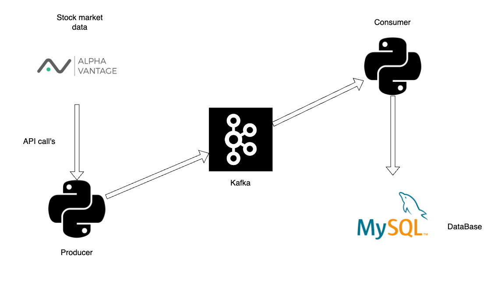

# StockStream: Real-Time Stock Data Streaming and Analysis

## Introduction

StockStream is a real-time stock data streaming application that fetches stock prices for multiple companies, streams the data using Apache Kafka, and then stores it in a MySQL database. The project demonstrates using Confluent Kafka, Python, and MySQL to handle real-time data processing and storage.

Kafka helps simplify the process of transmitting data between different systems. It acts as a middle layer that efficiently manages and transfers data from our Alpha Vantage API to a MySQL database. By using Kafka, we can easily handle real-time data flows, reduce the complexity of data transfer, and ensure that our data is reliably processed and stored.

## Features

- Real-time data streaming using Confluent Kafka
- Parallel data fetching for multiple companies
- MySQL database storage for processed data

## Architecture



## Installation

1. **Clone the Repository**:
    ```bash
    git clone https://github.com/yourusername/StockStream.git
    cd StockStream
    ```

2. **Install Dependencies**:
    ```bash
    pip install -r requirements.txt
    ```

3. **Set Up the Database**:
    - Execute the `db_setup.sql` script in your MySQL database to create the necessary tables.

4. **Configure API Keys and Database**:
    - Download `client.properties` from confluent for kafka instance
    - Update the `config.json` file with your API key and database credentials.

## Usage

1. **Run the Producer**:
    ```bash
    python producer.py
    ```

2. **Run the Consumer**:
    ```bash
    python consumer.py
    ```
